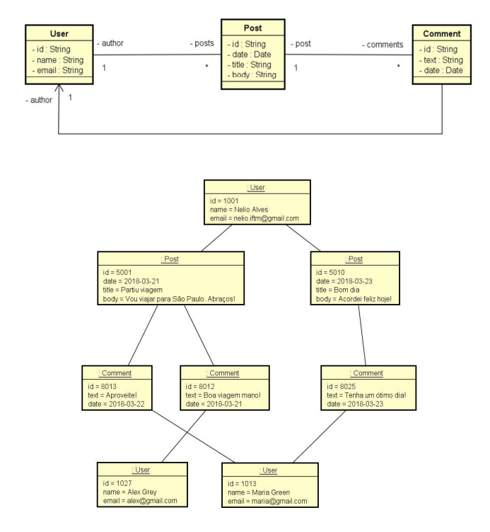

# Workshop: API Restful com Spring Boot e MongoDB


## Sobre o Projeto

Este projeto é uma API Restful desenvolvida em **Java** utilizando o framework **Spring Boot** e o banco de dados NoSQL **MongoDB**.

[cite_start]O objetivo principal foi explorar as capacidades do Spring Data MongoDB, entendendo as diferenças entre modelagem de dados relacional e orientada a documentos[cite: 375]. O projeto aborda a implementação de operações de CRUD, tratamento de exceções, padrões de projeto e consultas personalizadas.

## Funcionalidades

O sistema gerencia um domínio de interações sociais, permitindo:

* **Usuários (Users):**
    * [cite_start]CRUD completo (Criar, Ler, Atualizar, Deletar)[cite: 375].
    * [cite_start]Associação com Posts (um usuário possui vários posts)[cite: 563].
* **Postagens (Posts):**
    * [cite_start]Busca de post por ID[cite: 570].
    * [cite_start]**Busca Simples:** Procura por posts contendo um texto no título (Query Methods)[cite: 582].
    * [cite_start]**Busca Full Text:** Consulta personalizada com `@Query` e múltiplos critérios (texto no conteúdo + intervalo de datas)[cite: 597].
* **Comentários (Comments):**
    * [cite_start]Armazenamento de comentários aninhados dentro dos posts[cite: 576].

## Modelagem de Dados (NoSQL)

[cite_start]A estruturação dos dados no MongoDB utilizou dois conceitos principais para otimização e integridade[cite: 377]:

1.  [cite_start]**Referências (`@DBRef`):** Utilizado para ligar os Posts aos Usuários, evitando redundância excessiva de dados[cite: 563].
2.  **Objetos Aninhados (Embedded):**
    * [cite_start]`Author` dentro da coleção `Post`: Cópia dos dados do autor para otimizar a leitura sem necessidade de novas consultas (JOINs)[cite: 555].
    * [cite_start]`Comments` dentro da coleção `Post`: Comentários agregados diretamente à postagem[cite: 576].

### Diagrama de Classes
*(Certifique-se de salvar a imagem do diagrama na pasta `assets` do projeto)*



## Arquitetura e Tecnologias

* **Linguagem:** Java 17
* **Framework:** Spring Boot 3
* **Banco de Dados:** MongoDB
* **Persistência:** Spring Data MongoDB
* [cite_start]**Gerenciamento de Dependências:** Maven [cite: 417]
* **Design Patterns & Boas Práticas:**
    * [cite_start]**Layered Architecture:** Resource (Controller), Service e Repository[cite: 450].
    * [cite_start]**DTO (Data Transfer Object):** `UserDTO`, `AuthorDTO`, `CommentDTO` para projetar dados e proteger a entidade[cite: 489].
    * [cite_start]**Exception Handling:** Tratamento global de erros com `@ControllerAdvice` e exceções personalizadas como `ObjectNotFoundException`[cite: 515, 521].
    * [cite_start]**Database Seeding:** Carga inicial de dados para testes via `CommandLineRunner`[cite: 482].

## Como executar o projeto

### Pré-requisitos
* Java JDK 17 ou superior.
* [cite_start]MongoDB instalado e rodando na porta `27017`[cite: 469].
* Maven instalado (ou utilize o wrapper `./mvnw` incluso no projeto).

### Passo a passo

1.  Clone o repositório:
    ```bash
    git clone [https://github.com/SEU-USUARIO/SpringMongo-Social-API.git](https://github.com/SEU-USUARIO/SpringMongo-Social-API.git)
    ```

2.  Acesse a pasta do projeto:
    ```bash
    cd SpringMongo-Social-API
    ```

3.  Verifique a configuração do banco de dados no arquivo `src/main/resources/application.properties`:
    ```properties
    spring.data.mongodb.uri=mongodb://localhost:27017/workshop_mongo
    ```

4.  Execute a aplicação:
    ```bash
    ./mvnw spring-boot:run
    ```

A API estará disponível em: `http://localhost:8080`.

## Testando a API

Você pode testar os endpoints utilizando ferramentas como **Postman** ou **Thunder Client**.

**Principais Endpoints:**

* [cite_start]`GET /users` - Retorna todos os usuários[cite: 439].
* `POST /users` - Cria um novo usuário.
* [cite_start]`GET /users/{id}/posts` - Retorna os posts de um usuário específico[cite: 567].
* `GET /posts/{id}` - Busca um post por ID.
* [cite_start]`GET /posts/titlesearch?text=bom%20dia` - Busca posts por título[cite: 582].
* [cite_start]`GET /posts/fullsearch?text=viagem&minDate=2018-01-01&maxDate=2018-05-01` - Busca avançada por texto e período[cite: 597].

##  Créditos
Este projeto foi desenvolvido baseado no material do **Prof.Dr. Nelio Alves**.
